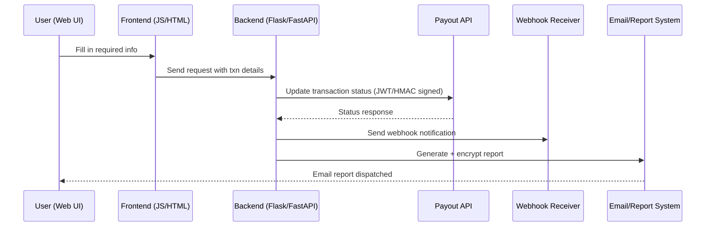

# 🌐 Payout Internal Tool (Web Version)

A **web-based automation tool** that streamlines **payout sandbox integration testing**.
It automates **transaction status updates** and **webhook notifications**, reducing the process from **\~2 hours to just 2 minutes**.

🌍 **Live Hosting:** [https://payout-tool.web.app/](https://payout-tool.web.app/)

---

## 🚀 Key Feature: Sandbox Update

### ⏳ Before (Manual Process)

* 10+ manual steps across Excel, SQL, and email.
* Required Development and Support involvement.
* Time: **\~2 hours**.

### ⚡ Now (Web Automation)

* User performs **1 simple step** (fill in required info).
* The tool automatically:

  1. Updates transaction status.
  2. Sends webhook notifications.
  3. Generates payout report.
  4. Encrypts files (if needed).
  5. Sends report via email.

⏱️ Time: **\~2 minutes**

✅ Benefits:

* **Internal** → Saves Engineering, Support, and Compliance hours.
* **External** → Faster partner onboarding & testing.

---

## 🌐 Why Web Version?

* 🚫 **No setup required** — just open in browser.
* 🎨 **Clean UI/UX** — guided flow for ease of use.
* ⚡ **Faster execution** — optimized backend.
* 🧹 **Refactored codebase** — modular and maintainable.

---

## 🧑‍💻 Tech Stack & Code Logic

### **Frontend**

* Built with **HTML, CSS, JavaScript** for clean UI.
* Provides **step-by-step form-based flow** to minimize user error.
* Implements input validation before sending requests.

### **Backend**

* Developed with **Python (Flask/FastAPI)**.
* Core responsibilities:

  * Handle API requests from the frontend.
  * Generate and sign **JWT/HMAC** for secure payout API calls.
  * Automate **webhook notifications** to simulate provider responses.
  * Create and **encrypt payout reports**.
  * Dispatch reports via **SMTP email**.

### **Automation Workflow**

1. User submits **transaction details** via UI.
2. Backend validates input → triggers **status update**.
3. **Webhook notification** automatically fired to target endpoint.
4. Report generated (CSV/ZIP) → **encrypted if needed**.
5. Email with attached report sent to relevant stakeholders.

This architecture ensures **minimal manual work**, **high consistency**, and **audit-ready documentation**.

---

## 📸 Screenshots

<p float="left">
  
  
</p>

---

## ⚡ Setup & Usage

```bash
# Clone repo
git clone https://github.com/nelsonwong5079/payout-internal-tool.git
cd payout-internal-tool

# Install dependencies
pip install -r requirements.txt

# Run server
python app.py

# Open in browser
http://localhost:5000
```

Or directly use the **hosted version**:
👉 [https://payout-tool.web.app/](https://payout-tool.web.app/)

Fill in the required input → the tool automates the rest.

---

## 🏗️ Architecture Diagram




---

